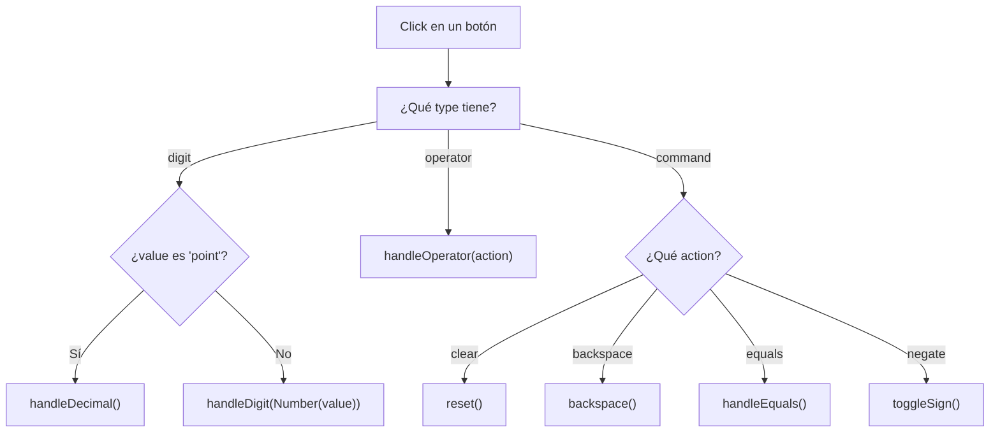
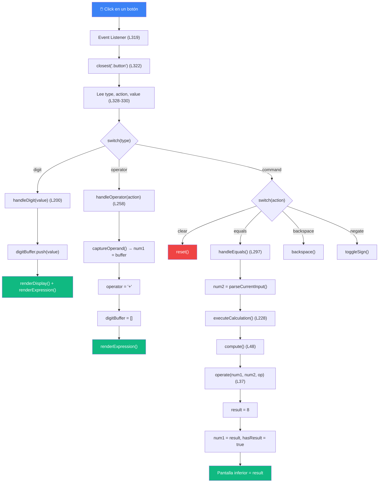

# 🗺️ Ruta de Lectura Detallada — [main.js](file:///home/andrew/Documents/the-odin-project/javascript/foundations/projects/calculator/main.js)

> [!IMPORTANT]
> **No leas este archivo de arriba a abajo.** El código está escrito en un orden lógico para la computadora, pero para **entenderlo como humano**, hay que seguir un orden diferente: el orden en que las cosas **suceden** cuando usas la calculadora.

---

## 📋 Tabla de Contenidos

1. [Paso 0: Antes del código — Entender el HTML](#paso-0)
2. [Paso 1: ¿Qué pasa cuando la página carga?](#paso-1)
3. [Paso 2: Las variables que guardan todo](#paso-2)
4. [Paso 3: El usuario hace click — El Event Listener](#paso-3)
5. [Paso 4: Se presionó un DÍGITO](#paso-4)
6. [Paso 5: Cómo se actualiza la pantalla](#paso-5)
7. [Paso 6: Se presionó un OPERADOR](#paso-6)
8. [Paso 7: Se presionó EQUALS (=)](#paso-7)
9. [Paso 8: El motor matemático](#paso-8)
10. [Paso 9: Los comandos secundarios (AC, ⌫, +/-)](#paso-9)
11. [Paso 10: Encadenamiento de operaciones](#paso-10)
12. [Resumen Visual del Flujo Completo](#resumen-visual)

---

<a id="paso-0"></a>
## 📖 Paso 0: Antes del código — Entender el HTML

**Lee primero:** [index.html](file:///home/andrew/Documents/the-odin-project/javascript/foundations/projects/calculator/index.html)

Antes de tocar JavaScript, necesitas entender **qué elementos existen en la página** y cómo están etiquetados, porque todo el JS depende de encontrarlos.

### La pantalla (líneas 21-24 del HTML)
```html
<div class="screen-container">
  <div class="screen-top-row"></div>    ← pantalla superior (muestra "5 + 3")
  <div class="screen-bottom-row"></div> ← pantalla inferior (muestra el número grande)
</div>
```
La calculadora tiene **dos filas de pantalla**:
- **Superior** (`screen-top-row`): muestra la expresión en progreso, ej: `5 + 3`
- **Inferior** (`screen-bottom-row`): muestra el número actual o el resultado, ej: `8`

### Los botones (líneas 26-57 del HTML)
Cada botón tiene **data attributes** que le dicen al JavaScript qué tipo de botón es:

```html
<!-- Un botón de DÍGITO: tiene data-type="digit" y data-value="5" -->
<button class="button" data-type="digit" data-value="5">5</button>

<!-- Un botón de OPERADOR: tiene data-type="operator" y data-action="add" -->
<button class="button" data-type="operator" data-action="add">+</button>

<!-- Un botón de COMANDO: tiene data-type="command" y data-action="clear" -->
<button class="button" data-type="command" data-action="clear">AC</button>
```

Hay **3 tipos** de botones:

| `data-type` | Botones | Atributo que usa |
|---|---|---|
| `"digit"` | 0, 1, 2, 3, 4, 5, 6, 7, 8, 9, . | `data-value` (ej: `"5"`, `"point"`) |
| `"operator"` | ÷, ×, −, + | `data-action` (ej: `"add"`, `"divide"`) |
| `"command"` | AC, +/-, ⌫, = | `data-action` (ej: `"clear"`, `"equals"`) |

> [!TIP]
> **Dato clave:** Los botones de **dígito** usan `data-value`. Los de **operador** y **comando** usan `data-action`. Esta diferencia es importante para entender el event listener.

---

<a id="paso-1"></a>
## 📖 Paso 1: ¿Qué pasa cuando la página carga?

**Lee:** [main.js líneas 357-359](file:///home/andrew/Documents/the-odin-project/javascript/foundations/projects/calculator/main.js#L357-L359)

```javascript
// Inicializamos la pantalla al cargar la página
renderDisplay();
renderExpression();
```

Cuando el navegador carga la página y ejecuta [main.js](file:///home/andrew/Documents/the-odin-project/javascript/foundations/projects/calculator/main.js), **lo primero que realmente importa** (lo que "arranca" la app) está al final del archivo. Estas dos líneas:

1. **[renderDisplay()](file:///home/andrew/Documents/the-odin-project/javascript/foundations/projects/calculator/main.js#75-93)** → Mira si hay algo en el `digitBuffer`. Como está vacío al inicio, muestra `"0"` en la pantalla inferior.
2. **[renderExpression()](file:///home/andrew/Documents/the-odin-project/javascript/foundations/projects/calculator/main.js#94-126)** → Mira si hay un `num1` u `operator`. Como ambos son `null` al inicio, la pantalla superior queda vacía.

**Resultado visible:** La calculadora muestra `0` abajo y nada arriba. ✅

Pero **antes** de que esas líneas se ejecuten, el navegador ya procesó todo lo de arriba:

**Lee:** [main.js líneas 1-11](file:///home/andrew/Documents/the-odin-project/javascript/foundations/projects/calculator/main.js#L1-L11)

```javascript
const screenTopRow = document.querySelector(".screen-top-row");
const screenBottomRow = document.querySelector(".screen-bottom-row");
const buttonContainer = document.querySelector(".button-container");

const SYMBOLS = { "/": "\u00F7", "*": "\u00D7", "-": "\u2212", "+": "\u002B" };
```

Esto hace 4 cosas:
1. **Guarda una referencia** al `<div>` de la pantalla superior → `screenTopRow`
2. **Guarda una referencia** al `<div>` de la pantalla inferior → `screenBottomRow`
3. **Guarda una referencia** al contenedor de todos los botones → `buttonContainer`
4. **Crea un diccionario** `SYMBOLS` que traduce operadores internos (`"/"`) a sus símbolos bonitos (`"÷"`)

> [!NOTE]
> **¿Por qué `SYMBOLS`?** Internamente el código usa `"/"`, `"*"`, `"-"`, `"+"` porque son los que entiende JavaScript para hacer cálculos. Pero en la pantalla queremos mostrar `÷`, `×`, `−`, `+` que se ven mejor. `SYMBOLS` es el traductor entre los dos mundos.

---

<a id="paso-2"></a>
## 📖 Paso 2: Las variables que guardan todo (El Estado)

**Lee:** [main.js líneas 13-30](file:///home/andrew/Documents/the-odin-project/javascript/foundations/projects/calculator/main.js#L13-L30)

```javascript
let digitBuffer = [];
let num1 = null;
let num2 = null;
let operator = null;
let hasResult = false;
```

Estas 5 variables son **el corazón de la calculadora**. Todo lo demás gira alrededor de leerlas y modificarlas. Piensa en ellas como "la memoria" de la calculadora:

### 📝 `digitBuffer = []` — El bloc de notas temporal
Es un **arreglo** que va acumulando los caracteres que el usuario escribe. Cada vez que presionas un dígito, se agrega al final.

```
Presionar "1" → digitBuffer = ["1"]
Presionar "2" → digitBuffer = ["1", "2"]
Presionar "." → digitBuffer = ["1", "2", "."]
Presionar "5" → digitBuffer = ["1", "2", ".", "5"]
```

Cuando necesitamos convertirlo a un número real, usamos `digitBuffer.join("")` → `"12.5"` → `parseFloat("12.5")` → `12.5`

> [!TIP]
> **Analogía:** `digitBuffer` es como escribir un número con lápiz en un papel borrador. Cada tecla agrega un carácter. Cuando presionas un operador (+, -, etc.), "arrancas la hoja", guardas el número, y empiezas a escribir uno nuevo.

### 🔢 `num1 = null` y `num2 = null` — Los dos operandos
Toda operación tiene la forma: **num1 [operador] num2**. Por ejemplo: `5 + 3`.

- `num1` = el primer número (5)
- `num2` = el segundo número (3)

Empiezan en `null` porque aún no se ha ingresado ningún número.

### ➕ `operator = null` — El operador
Guarda qué operación se va a hacer: `"+"`, `"-"`, `"*"` o `"/"`.

### ✅ `hasResult = false` — ¿Ya hay un resultado?
Esta es una **bandera** (flag). Cuando es `true`, significa que la pantalla está mostrando el resultado de una operación anterior. Sirve para:
- Si presionas un **dígito** después de un resultado → se limpia todo y empiezas de nuevo
- Si presionas un **operador** después de un resultado → el resultado se usa como `num1` para la siguiente operación

### 🎯 Estado a lo largo de una operación `5 + 3 = 8`:

| Momento | `digitBuffer` | `num1` | `operator` | `num2` | `hasResult` |
|---|---|---|---|---|---|
| Inicio | `[]` | `null` | `null` | `null` | `false` |
| Presionar "5" | `["5"]` | `null` | `null` | `null` | `false` |
| Presionar "+" | `[]` | `5` | `"+"` | `null` | `false` |
| Presionar "3" | `["3"]` | `5` | `"+"` | `null` | `false` |
| Presionar "=" | `[]` | `8` | `null` | `null` | `true` |

> [!IMPORTANT]
> **Regresa a esta tabla cada vez que te pierdas en el código.** Si entiendes cómo cambian estas 5 variables paso a paso, entiendes toda la calculadora.

---

<a id="paso-3"></a>
## 📖 Paso 3: El usuario hace click — El Event Listener

**Lee:** [main.js líneas 312-355](file:///home/andrew/Documents/the-odin-project/javascript/foundations/projects/calculator/main.js#L312-L355)

Este es **el punto de entrada de toda la acción**. Cada vez que el usuario hace click en cualquier botón, el flujo empieza aquí.

```javascript
buttonContainer.addEventListener("click", function (event) {
```

**¿Qué es "delegación de eventos"?** En vez de poner un `addEventListener` en cada uno de los 19 botones, ponemos **uno solo** en el `<div>` que los contiene a todos (`.button-container`). Cuando haces click en un botón hijo, el evento "burbujea" (sube) hasta el contenedor padre, y lo atrapamos ahí.

### Paso 3.1: Encontrar qué botón se clickeó

```javascript
const target = event.target.closest(".button");
if (!target) return;
```

- `event.target` = el elemento exacto donde se hizo click (podría ser el texto del botón, o incluso el SVG del ícono de backspace)
- `.closest(".button")` = sube por el DOM hasta encontrar el ancestro más cercano que tenga la clase `"button"`. Si el click fue en el SVG del backspace, sube hasta el `<button>` que lo contiene.
- Si `target` es `null` (se hizo click en un espacio vacío entre botones), `return` termina y no pasa nada.

### Paso 3.2: Leer los data attributes

```javascript
const type = target.dataset.type;     // "digit", "operator", o "command"
const action = target.dataset.action;  // "clear", "add", "divide", etc.
const value = target.dataset.value;    // "0"-"9" o "point"
```

Aquí leemos las "etiquetas" que pusimos en el HTML. Por ejemplo, si se clickeó el botón `5`:
- `type` = `"digit"`
- `action` = `undefined` (los dígitos no tienen `data-action`)
- `value` = `"5"`

Si se clickeó el botón `+`:
- `type` = `"operator"`
- `action` = `"add"`
- `value` = `undefined` (los operadores no tienen `data-value`)

### Paso 3.3: Dirigir al lugar correcto (el switch)

```javascript
switch (type) {
  case "digit":
    if (value === "point") {
      handleDecimal();
    } else {
      handleDigit(Number(value));
    }
    break;

  case "operator":
    handleOperator(action);
    break;

  case "command":
    switch (action) {
      case "clear":     reset();       break;
      case "backspace": backspace();   break;
      case "equals":    handleEquals(); break;
      case "negate":    toggleSign();   break;
    }
    break;
}
```

Este `switch` es como un **semáforo de tránsito**: según el tipo de botón, dirige el flujo a la función correcta.



> [!NOTE]
> **`Number(value)`**: `value` viene del HTML como string `"5"`. `Number("5")` lo convierte al número `5`. Esto es necesario porque `digitBuffer.push("5")` guardaría un string, pero `digitBuffer.push(5)` guarda un número. Aunque ambos funcionan para mostrar en pantalla, guardar números es más correcto conceptualmente.

---

<a id="paso-4"></a>
## 📖 Paso 4: Se presionó un DÍGITO (0-9)

**Lee:** [main.js líneas 199-213](file:///home/andrew/Documents/the-odin-project/javascript/foundations/projects/calculator/main.js#L199-L213)

```javascript
function handleDigit(value) {
  if (hasResult) reset();

  if (digitBuffer.length === 1 && digitBuffer[0] === 0) {
    if (value === 0) return;
    digitBuffer.pop();
  }

  digitBuffer.push(value);
  renderDisplay();
  renderExpression();
}
```

Leamos línea por línea:

### Línea: `if (hasResult) reset();`
**Pregunta:** ¿La pantalla está mostrando el resultado de una operación anterior?

Si sí → limpia todo y empieza de cero. Esto es lo que pasa cuando haces `5 + 3 = 8` y luego presionas `2`: el `8` desaparece y empieza a escribirse `2`.

### Líneas: El bloque de ceros
```javascript
if (digitBuffer.length === 1 && digitBuffer[0] === 0) {
  if (value === 0) return;    // Si ya hay un "0" y presionas otro "0" → no hacer nada
  digitBuffer.pop();           // Si ya hay un "0" y presionas otro dígito → quitar el "0"
}
```
Esto previene que escribas `007`. Si el buffer tiene solo un `0` y presionas otro número, reemplaza el `0` por el nuevo número.

### Línea: `digitBuffer.push(value);`
**Esta es la línea más importante.** Agrega el dígito al final del buffer.

### Líneas finales:
```javascript
renderDisplay();     // Actualiza la pantalla inferior con el contenido del buffer
renderExpression();  // Actualiza la pantalla superior (por si estamos en medio de "5 + ...")
```

> [!TIP]
> **El patrón que se repite:** Casi todas las funciones de mutación de estado terminan con [renderDisplay()](file:///home/andrew/Documents/the-odin-project/javascript/foundations/projects/calculator/main.js#75-93) y/o [renderExpression()](file:///home/andrew/Documents/the-odin-project/javascript/foundations/projects/calculator/main.js#94-126). Esto es el ciclo: **modificar estado → actualizar pantalla**.

---

<a id="paso-5"></a>
## 📖 Paso 5: Cómo se actualiza la pantalla

### 5A: La pantalla inferior — [renderDisplay()](file:///home/andrew/Documents/the-odin-project/javascript/foundations/projects/calculator/main.js#75-93)

**Lee:** [main.js líneas 75-92](file:///home/andrew/Documents/the-odin-project/javascript/foundations/projects/calculator/main.js#L75-L92)

```javascript
function renderDisplay() {
  if (digitBuffer.length === 0) {
    if (num1 !== null && hasResult) {
      screenBottomRow.textContent = num1;
    } else {
      screenBottomRow.textContent = "0";
    }
  } else {
    screenBottomRow.textContent = digitBuffer.join("");
  }
  updateDecimalState();
}
```

Esta función decide qué mostrar en la **pantalla grande** (inferior). La lógica es:

```
¿Hay algo en el digitBuffer?
├── SÍ → Mostrar lo que el usuario está escribiendo (ej: "12.5")
└── NO → ¿Hay un resultado previo (num1) y hasResult es true?
         ├── SÍ → Mostrar ese resultado (ej: "8")
         └── NO → Mostrar "0"
```

`digitBuffer.join("")` convierte `["1", "2", ".", "5"]` en el string `"12.5"`.

Al final llama a [updateDecimalState()](file:///home/andrew/Documents/the-odin-project/javascript/foundations/projects/calculator/main.js#127-135) que desactiva el botón `.` si ya hay un punto decimal (para que no puedas escribir `1.2.3`).

### 5B: La pantalla superior — [renderExpression()](file:///home/andrew/Documents/the-odin-project/javascript/foundations/projects/calculator/main.js#94-126)

**Lee:** [main.js líneas 94-125](file:///home/andrew/Documents/the-odin-project/javascript/foundations/projects/calculator/main.js#L94-L125)

```javascript
function renderExpression(showFullExpression) {
  let display = "";

  // Modo especial para cuando presionas "="
  if (showFullExpression && num1 !== null && num2 !== null && operator !== null) {
    display = num1 + " " + SYMBOLS[operator] + " " + num2;
    screenTopRow.textContent = display;
    return;    // ← IMPORTANTE: sale inmediatamente, no ejecuta el resto
  }

  // Construcción normal
  if (num1 !== null) {
    display += num1;                            // "5"
  }
  if (operator !== null) {
    display += " " + SYMBOLS[operator] + " ";   // "5 + "
  }
  if (operator !== null && !hasResult) {
    if (digitBuffer.length > 0) {
      display += digitBuffer.join("");           // "5 + 3"
    } else if (num2 !== null) {
      display += num2;
    }
  }

  screenTopRow.textContent = display;
}
```

Esta función construye el string de la expresión **pieza por pieza**, como armando un rompecabezas:

| Estado | `display` se construye como | Resultado |
|---|---|---|
| Solo `num1 = 5` | `"5"` | `5` |
| `num1 = 5`, `operator = "+"` | `"5"` + `" + "` | `5 + ` |
| `num1 = 5`, `operator = "+"`, buffer = `["3"]` | `"5"` + `" + "` + `"3"` | `5 + 3` |

**El modo `showFullExpression`** solo se usa en un lugar: justo antes de mostrar un resultado. Se llama con [renderExpression(true)](file:///home/andrew/Documents/the-odin-project/javascript/foundations/projects/calculator/main.js#94-126) para "congelar" la expresión completa (`"5 + 3"`) arriba antes de que `num1` se sobrescriba con el resultado.

> [!NOTE]
> **¿Por qué `SYMBOLS[operator]` en vez de solo `operator`?** Para que en la pantalla aparezca `÷` en vez de `/`, y `×` en vez de `*`. Los símbolos bonitos son para el usuario; los internos son para los cálculos.

---

<a id="paso-6"></a>
## 📖 Paso 6: Se presionó un OPERADOR (+, -, ×, ÷)

**Lee:** [main.js líneas 257-294](file:///home/andrew/Documents/the-odin-project/javascript/foundations/projects/calculator/main.js#L257-L294)

Esta es una de las funciones más complejas. Léela **saltando el bloque `if` del encadenamiento** por ahora (líneas 261-277). Ese caso especial lo veremos en el [Paso 10](#paso-10).

### Caso normal (primera vez que presionas un operador):

```javascript
function handleOperator(action) {
  // [SALTAR POR AHORA: líneas 261-277 — encadenamiento]
  
  // CASO NORMAL: guardamos el número actual como num1
  captureOperand();       // ← convierte el digitBuffer en num1

  // Convertimos el nombre del botón al símbolo del operador
  switch (action) {
    case "divide":   operator = "/"; break;
    case "multiply": operator = "*"; break;
    case "subtract": operator = "-"; break;
    case "add":      operator = "+"; break;
  }

  hasResult = false;
  digitBuffer = [];       // ← limpiamos el buffer para escribir el segundo número
  renderExpression();     // ← actualiza la pantalla superior
}
```

### ¿Qué hace [captureOperand()](file:///home/andrew/Documents/the-odin-project/javascript/foundations/projects/calculator/main.js#215-226)?

**Lee:** [main.js líneas 215-225](file:///home/andrew/Documents/the-odin-project/javascript/foundations/projects/calculator/main.js#L215-L225)

```javascript
function captureOperand() {
  const parsed = parseCurrentInput();  // Convierte digitBuffer a número
  if (parsed !== null) {
    if (num1 === null) {
      num1 = parsed;                   // Es el primer número
    } else if (operator !== null && !hasResult) {
      num2 = parsed;                   // Es el segundo número
    }
  }
}
```

Y [parseCurrentInput()](file:///home/andrew/Documents/the-odin-project/javascript/foundations/projects/calculator/main.js#62-70) simplemente hace:

**Lee:** [main.js líneas 62-69](file:///home/andrew/Documents/the-odin-project/javascript/foundations/projects/calculator/main.js#L62-L69)

```javascript
function parseCurrentInput() {
  if (digitBuffer.length > 0) {
    return parseFloat(digitBuffer.join(""));  // ["1","2",".","5"] → "12.5" → 12.5
  }
  return null;
}
```

### Flujo completo cuando presionas `+` después de escribir `5`:

```
1. handleOperator("add") se ejecuta
2. captureOperand() se ejecuta:
   - parseCurrentInput() convierte ["5"] → "5" → 5.0
   - Como num1 es null, guarda: num1 = 5
3. El switch convierte "add" → operator = "+"
4. hasResult = false
5. digitBuffer = [] (limpia el buffer para el segundo número)
6. renderExpression() muestra "5 + " en la pantalla superior
```

---

<a id="paso-7"></a>
## 📖 Paso 7: Se presionó EQUALS (=)

**Lee:** [main.js líneas 296-310](file:///home/andrew/Documents/the-odin-project/javascript/foundations/projects/calculator/main.js#L296-L310)

```javascript
function handleEquals() {
  if (num1 === null || operator === null) return;  // Necesitamos al menos num1 y operador

  if (digitBuffer.length > 0) {
    num2 = parseCurrentInput();      // Convertimos el buffer al segundo número
  } else if (num2 === null) {
    return;                          // No hay nada que calcular
  }

  executeCalculation();
}
```

Esta función es corta pero importante. Hace dos cosas:
1. **Valida** que tengamos lo necesario para calcular (num1 y un operador)
2. **Captura num2** del digitBuffer
3. **Llama a [executeCalculation()](file:///home/andrew/Documents/the-odin-project/javascript/foundations/projects/calculator/main.js#227-256)** que hace el cálculo real

### ¿Qué hace [executeCalculation()](file:///home/andrew/Documents/the-odin-project/javascript/foundations/projects/calculator/main.js#227-256)?

**Lee:** [main.js líneas 227-255](file:///home/andrew/Documents/the-odin-project/javascript/foundations/projects/calculator/main.js#L227-L255)

```javascript
function executeCalculation() {
  if (num1 === null || num2 === null || operator === null) return;

  const result = compute();                    // ← Calcula el resultado

  if (result && result.error === "DIV_BY_ZERO") {
    reset();
    screenTopRow.textContent = "DIV BY ZERO 🌌";
    screenBottomRow.textContent = "INFINITY";
    return;
  }

  renderExpression(true);     // Muestra "5 + 3" arriba (expresión completa)

  num1 = result;              // El resultado se convierte en el nuevo num1
  hasResult = true;           // Marcamos que hay un resultado
  digitBuffer = [];           // Limpiamos el buffer

  screenBottomRow.textContent = result;  // Mostramos "8" abajo

  operator = null;            // Ya no hay operador pendiente
  num2 = null;                // Ya no hay segundo número
}
```

### Flujo paso a paso de `5 + 3 =`:

```
handleEquals()
├── num1=5, operator="+", buffer=["3"]  →  Todo OK, seguimos
├── num2 = parseCurrentInput() → 3
└── executeCalculation()
    ├── compute() → operate(5, 3, "+") → 8
    ├── renderExpression(true) → muestra "5 + 3" arriba
    ├── num1 = 8  ← EL RESULTADO SE GUARDA COMO NUEVO num1
    ├── hasResult = true
    ├── digitBuffer = []
    ├── pantalla inferior = "8"
    ├── operator = null
    └── num2 = null
```

> [!IMPORTANT]
> **Detalle crucial:** `num1 = result` (línea 245). El resultado **no se descarta**, sino que se guarda como `num1`. Esto permite que si después presionas `+ 2 =`, la calculadora haga `8 + 2 = 10`. Es la base del encadenamiento.

---

<a id="paso-8"></a>
## 📖 Paso 8: El motor matemático

**Lee:** [main.js líneas 32-60](file:///home/andrew/Documents/the-odin-project/javascript/foundations/projects/calculator/main.js#L32-L60)

### [operate(a, b, op)](file:///home/andrew/Documents/the-odin-project/javascript/foundations/projects/calculator/main.js#36-46) — La función más pura

```javascript
function operate(a, b, op) {
  switch (op) {
    case "+": return a + b;
    case "-": return a - b;
    case "*": return a * b;
    case "/": return a / b;
    default:  return null;
  }
}
```

Es la función más simple del archivo. Recibe dos números y un operador, devuelve el resultado. No modifica ninguna variable global. No toca la pantalla. Solo hace matemáticas.

### [compute()](file:///home/andrew/Documents/the-odin-project/javascript/foundations/projects/calculator/main.js#47-61) — El validador + calculador

```javascript
function compute() {
  if (num1 === null || num2 === null || operator === null) return null;

  if (operator === "/" && num2 === 0) {
    return { error: "DIV_BY_ZERO" };
  }

  let result = operate(num1, num2, operator);
  return Math.round(result * 1000) / 1000;
}
```

Esta función envuelve a [operate()](file:///home/andrew/Documents/the-odin-project/javascript/foundations/projects/calculator/main.js#36-46) y le agrega:
1. **Validación**: ¿tenemos todo lo necesario?
2. **Caso especial**: ¿estamos dividiendo entre cero? Si sí, devuelve un objeto `{ error: "DIV_BY_ZERO" }` en vez de un número.
3. **Redondeo**: `Math.round(result * 1000) / 1000` redondea a 3 decimales. Esto evita que `0.1 + 0.2` muestre `0.30000000000000004` (un error clásico de punto flotante en JavaScript).

> [!NOTE]
> **¿Por qué `{ error: "DIV_BY_ZERO" }` en vez de solo `null`?** Porque quien llama a [compute()](file:///home/andrew/Documents/the-odin-project/javascript/foundations/projects/calculator/main.js#47-61) necesita distinguir entre "no hay nada que calcular" (`null`) y "hubo un error de división entre cero" (el objeto de error). Son dos situaciones diferentes que requieren respuestas diferentes.

---

<a id="paso-9"></a>
## 📖 Paso 9: Los comandos secundarios

### 9A: [reset()](file:///home/andrew/Documents/the-odin-project/javascript/foundations/projects/calculator/main.js#140-150) — Botón AC

**Lee:** [main.js líneas 140-149](file:///home/andrew/Documents/the-odin-project/javascript/foundations/projects/calculator/main.js#L140-L149)

```javascript
function reset() {
  digitBuffer = [];
  num1 = null;
  num2 = null;
  operator = null;
  hasResult = false;
  renderDisplay();
  renderExpression();
}
```

Vuelve **todas** las variables a su estado inicial y limpia la pantalla. Es como apagar y encender la calculadora.

### 9B: [backspace()](file:///home/andrew/Documents/the-odin-project/javascript/foundations/projects/calculator/main.js#151-159) — Botón ⌫

**Lee:** [main.js líneas 151-158](file:///home/andrew/Documents/the-odin-project/javascript/foundations/projects/calculator/main.js#L151-L158)

```javascript
function backspace() {
  if (digitBuffer.length > 0) {
    digitBuffer.pop();        // Quita el último carácter del buffer
    renderDisplay();
    renderExpression();
  }
}
```

Solo funciona si hay algo en el buffer. `pop()` quita el último elemento del arreglo (el último dígito que escribiste).

### 9C: [toggleSign()](file:///home/andrew/Documents/the-odin-project/javascript/foundations/projects/calculator/main.js#160-181) — Botón +/-

**Lee:** [main.js líneas 160-180](file:///home/andrew/Documents/the-odin-project/javascript/foundations/projects/calculator/main.js#L160-L180)

```javascript
function toggleSign() {
  // Caso 1: Editando el buffer
  if (digitBuffer.length > 0) {
    if (digitBuffer[0] === "-") {
      digitBuffer.shift();           // Quita "-" del inicio → positivo
    } else {
      digitBuffer.unshift("-");      // Agrega "-" al inicio → negativo
    }
    renderDisplay();
    renderExpression();
    return;
  }

  // Caso 2: Invertir un resultado previo
  if (hasResult && num1 !== null) {
    num1 = num1 * -1;
    screenBottomRow.textContent = num1;
    renderExpression();
  }
}
```

Dos escenarios:
- **Caso 1**: Estás escribiendo un número → agrega o quita el `"-"` del inicio del buffer. (`shift/unshift` son como `pop/push` pero para el **inicio** del arreglo en vez del final)
- **Caso 2**: Ya hay un resultado en pantalla → multiplica `num1` por `-1`

### 9D: [handleDecimal()](file:///home/andrew/Documents/the-odin-project/javascript/foundations/projects/calculator/main.js#182-198) — Botón "."

**Lee:** [main.js líneas 182-197](file:///home/andrew/Documents/the-odin-project/javascript/foundations/projects/calculator/main.js#L182-L197)

```javascript
function handleDecimal() {
  if (hasResult) reset();

  if (!digitBuffer.includes(".")) {
    if (digitBuffer.length === 0) {
      digitBuffer.push("0", ".");    // "." solo → "0."
    } else {
      digitBuffer.push(".");
    }
    renderDisplay();
    renderExpression();
  }
}
```

Dos protecciones:
1. **No permite dos puntos**: `if (!digitBuffer.includes("."))` — si ya hay un punto, no agrega otro
2. **Punto solitario**: si presionas `.` sin haber escrito nada, en vez de mostrar solo `.`, muestra `0.`

---

<a id="paso-10"></a>
## 📖 Paso 10: Encadenamiento de operaciones

**Lee:** [main.js líneas 258-277](file:///home/andrew/Documents/the-odin-project/javascript/foundations/projects/calculator/main.js#L258-L277)

Este es el caso más complejo. Ocurre cuando haces algo como `5 + 5 + 2 =`:

```javascript
function handleOperator(action) {
  // CASO ESPECIAL: ya hay num1, operador, Y el usuario escribió más dígitos
  if (num1 !== null && operator !== null && digitBuffer.length > 0 && !hasResult) {
    num2 = parseCurrentInput();

    const result = compute();        // Calcula el resultado intermedio

    if (result && result.error === "DIV_BY_ZERO") {
      // ... manejo de error ...
      return;
    }

    num1 = result;                   // El resultado intermedio es el nuevo num1
    num2 = null;
    screenBottomRow.textContent = result;
  } else {
    captureOperand();                // Caso normal
  }

  // ... resto de la función (switch del operador, limpiar buffer, etc.)
}
```

### Flujo de `5 + 5 + 2 =`:

| Acción | Lo que pasa | Estado después |
|---|---|---|
| Presionar `5` | `digitBuffer = ["5"]` | buffer=["5"], num1=null |
| Presionar `+` | Caso normal: [captureOperand()](file:///home/andrew/Documents/the-odin-project/javascript/foundations/projects/calculator/main.js#215-226) → num1=5 | num1=5, op="+", buffer=[] |
| Presionar `5` | `digitBuffer = ["5"]` | num1=5, op="+", buffer=["5"] |
| Presionar `+` **(segundo +)** | **¡Encadenamiento!** num1≠null, op≠null, buffer>0 | ⬇️ ver abajo |
| | `num2 = 5`, [compute()](file:///home/andrew/Documents/the-odin-project/javascript/foundations/projects/calculator/main.js#47-61) → `5+5=10` | num1=**10**, op="+", buffer=[] |
| Presionar `2` | `digitBuffer = ["2"]` | num1=10, op="+", buffer=["2"] |
| Presionar `=` | `num2=2`, [compute()](file:///home/andrew/Documents/the-odin-project/javascript/foundations/projects/calculator/main.js#47-61) → `10+2=12` | num1=**12**, hasResult=true |

> [!TIP]
> **La clave del encadenamiento** es que cuando presionas un operador por segunda vez, la calculadora **no espera** a que presiones `=`. Calcula el resultado intermedio inmediatamente, lo guarda como nuevo `num1`, y usa el nuevo operador para la siguiente operación.

---

<a id="resumen-visual"></a>
## 🎯 Resumen Visual del Flujo Completo

### Orden recomendado de lectura (por número de línea):

```
📖 ORDEN DE LECTURA RECOMENDADO:

 1.  Líneas 357-359  → Inicialización (por dónde arranca la app)
 2.  Líneas 1-11     → Constantes y DOM (qué elementos se capturan)
 3.  Líneas 13-30    → Estado (las 5 variables centrales)
 4.  Líneas 312-355  → Event Listener (el punto de entrada de cada click)
 5.  Líneas 199-213  → handleDigit (qué pasa al presionar un número)
 6.  Líneas 75-92    → renderDisplay (cómo se actualiza la pantalla inferior)
 7.  Líneas 94-125   → renderExpression (cómo se actualiza la pantalla superior)
 8.  Líneas 215-225  → captureOperand (cómo se "guarda" un número)
 9.  Líneas 257-294  → handleOperator (qué pasa al presionar +, -, ×, ÷)
10.  Líneas 296-310  → handleEquals (qué pasa al presionar =)
11.  Líneas 227-255  → executeCalculation (cómo se ejecuta el cálculo)
12.  Líneas 47-60    → compute + operate (el motor matemático)
13.  Líneas 140-197  → Comandos secundarios (AC, ⌫, +/-, .)
14.  Líneas 127-134  → updateDecimalState (detalle del botón punto)
```

### Diagrama del flujo completo:



### La regla de oro para leer este código:

> **Sigue siempre el camino: CLICK → SWITCH → FUNCIÓN → ESTADO → PANTALLA**
>
> Todo empieza con un click, se dirige por el switch, llega a una función específica, esa función modifica las variables de estado, y al final se actualiza la pantalla.
